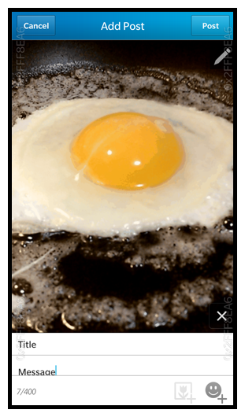

# BBM Channels Sample

This sample demonstrates how to invoke BBM Channels. You'll learn how to open, and post to BBM Channels.

**Applies To**

* [BBM Channels](http://us.blackberry.com/bbm/bbm-channels.html)
* [BlackBerry 10 WebWorks SDK](https://developer.blackberry.com/html5/download/sdk) 

**Author(s)** 

* [Chad Tetreault](http://www.twitter.com/chadtatro)

**Dependencies**

1. [bbUI.js](https://github.com/blackberry/bbUI.js) is [licensed](https://github.com/blackberry/bbUI.js/blob/master/LICENSE) under the Apache 2.0 license.

**Icons**

* The [Liz Myers](http://www.myersdesign.com) Icon set and are [licensed](http://creativecommons.org/licenses/by/3.0/) under the CC-BY-3.0 license.

**Contributing**

* To contribute code to this repository you must be [signed up as an official contributor](http://blackberry.github.com/howToContribute.html).

## Screenshots ##

## Using The Sample ##

####Invoking a Channel

**The following code is used to invoke, and view a Channel**

	var request = {
		target: "sys.bbm.channels.card.previewer",
		action: "bb.action.OPENBBMCHANNEL",
		uri: "bbmc:C00124CF8"
	};
	
	blackberry.invoke.invoke(
		request,

		function() {
			console.log('success');
		},

		function(e) {
			console.log(e);
		}
	);

####Sharing Text

**The following code is used to share text to a Channel**

    var request = {
		target: "sys.bbm.channels.sharehandler",
		type: "text/plain",
		action: "bb.action.SHARE",
		data: "this is a test"
	};
	
	blackberry.invoke.invoke(
		request,

		function() {
			console.log('success');
		},

		function(e) {
			console.log(e);
		}
	);
	

####Sharing Photos

**The following code is used for sharing a photo with a Channel**

	var request = {
		target: "sys.bbm.channels.sharehandler",
		action: "bb.action.SHARE",
		uri: "local:///test.gif"
	};

	blackberry.invoke.invoke(
		request,

		function() {
			console.log('success');
		},

		function(e) {
			console.log(e);
		}
	);
	

## How To Build

1. Clone the repo to your local machine
2. Use Using the Ripple Mobile Emulator and the BlackBerry 10 WebWorks SDK, package the contents of your local BB10-WebWorks-Samples/Boilerplate-bbUI.js-0.9x folder into a BlackBerry application.

## More Info

* [BlackBerry HTML5 WebWorks](https://bdsc.webapps.blackberry.com/html5/) - Downloads, Getting Started guides, samples, code signing keys.
* [BlackBerry WebWorks Development Guides](https://bdsc.webapps.blackberry.com/html5/documentation)
* [BlackBerry WebWorks Community Forums](http://supportforums.blackberry.com/t5/Web-and-WebWorks-Development/bd-p/browser_dev)
* [BlackBerry Open Source WebWorks Contributions Forums](http://supportforums.blackberry.com/t5/BlackBerry-WebWorks/bd-p/ww_con)

## Contributing Changes

Please see the [README](https://github.com/blackberry/BB10-WebWorks-Samples) of the BB10-WebWorks-Samples repository for instructions on how to add new Samples or make modifications to existing Samples.

## Bug Reporting and Feature Requests

If you find a bug in a Sample, or have an enhancement request, simply file an [Issue](https://github.com/blackberry/BB10-WebWorks-Samples/issues) for the Sample.

## Disclaimer

THE SOFTWARE IS PROVIDED "AS IS", WITHOUT WARRANTY OF ANY KIND, EXPRESS OR IMPLIED, INCLUDING BUT NOT LIMITED TO THE WARRANTIES OF MERCHANTABILITY, FITNESS FOR A PARTICULAR PURPOSE AND NONINFRINGEMENT. IN NO EVENT SHALL THE AUTHORS OR COPYRIGHT HOLDERS BE LIABLE FOR ANY CLAIM, DAMAGES OR OTHER LIABILITY, WHETHER IN AN ACTION OF CONTRACT, TORT OR OTHERWISE, ARISING FROM, OUT OF OR IN CONNECTION WITH THE SOFTWARE OR THE USE OR OTHER DEALINGS IN THE SOFTWARE.
