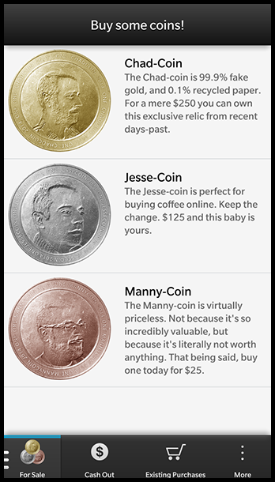
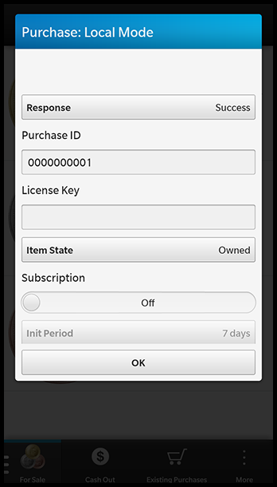

# WebWorks Payment Sample
This sample demonstrates how to get started with the [BlackBerry Payment Service](https://developer.blackberry.com/html5/apis/v2_0/blackberry.payment.html) for BlackBerry 10.

**Applies To**

* [Payment Service](https://developer.blackberry.com/html5/apis/v2_0/blackberry.payment.html)
* [BlackBerry 10 WebWorks SDK](https://developer.blackberry.com/html5/downloads/) 

**Author(s)** 

* [Chad Tetreault](http://www.twitter.com/chadtatro)

**Dependencies**

1. [bbUI.js](https://github.com/blackberry/bbUI.js) is [licensed](https://github.com/blackberry/bbUI.js/blob/master/LICENSE) under the Apache 2.0 license.

**Coin Graphics**

* Thank you to [Jesse Ariss](http://twitter.com/jesseariss) for the graphics.

**Contributing**

* To contribute code to this repository you must be [signed up as an official contributor](http://blackberry.github.com/howToContribute.html).

## Screenshots ##




## Required Plugins ##

####The following Cordova Plugins are required for this sample:####

	com.blackberry.app
	com.blackberry.payment
	com.blackberry.ui.toast
	com.blackberry.utils
	
## Using The Sample ##

####Development Mode
**To test locally you *must* enable development mode in your code *before* making any calls to the Payment Service!**

	// turn on development mode for the payment service
    blackberry.payment.developmentMode = true;


####Making a Purchase


**The following code is used make a purchase. You'll be prompted with a Purchase dialog where you're able to set the properties of your purchase. *(See screenshot 2)***

	var paymentObject = {
    	"digitalGoodID": "123",
        "digitalGoodSKU": "",
        "purchaseAppName": "Payment Sample",
        "purchaseAppIcon": null,
    };
    
    // call the payment service
    blackberry.payment.purchase(paymentObject,

        // success callback
        function(data) {
            var msg = "Successfully purchased a: " + data.digitalGoodSKU;
            blackberry.ui.toast.show(msg, false);
            coins[data.digitalGoodSKU]++;
        },

        // error callback
        function(data) {
            var msg = "Error: " + data.errorText;
            blackberry.ui.toast.show(msg, false);
		}		
	);
        
####Check Existing Purchases

**The following code is used for checking existing purchases. An object will be returned to you which lists all of the purchases the user has made in your app.**

*Note that for local testing you must pass in *'false'* to the API call. The returned purchase object will apply for the current application instance, and clears upon exit.*

    blackberry.payment.getExistingPurchases(

		// pass in 'false' for local mode
    	false,

	    // success callback
    	function(data) {
			console.log('success: ' + data);
	    }, 
	    
	    // fail callback
		function() {
	    	console.log('fail');
	    });    
    }
	

## How to Build

1. Clone this repo to your local machine.

2. Ensure the [BlackBerry 10 WebWorks SDK 2.0](https://developer.blackberry.com/html5/download/sdk) is correctly installed.
3. Open a command prompt (windows) or terminal (mac) and run the following command:

	```
	webworks create <your source folder>\Payments
	```

4. **Replace** the default Payments\www folder with the \www folder from **this** project

5. **Replace** the default Payments\config.xml with the config.xml from **this** project

6. From the command prompt (Windows) or terminal (mac), navigate to the Payments folder

	```
	cd <your source folder>\Payments
	```

7. Run the following commands to configure plugins used by **this app**

	```
	webworks plugin add com.blackberry.app
	webworks plugin add com.blackberry.payment
	webworks plugin add com.blackberry.utils
	webworks plugin add com.blackberry.ui.toast
	```

8. Run the following command to build and deploy the app to a device connected via USB

	```
	webworks run
	```

## More Info

* [BlackBerry HTML5 WebWorks](https://bdsc.webapps.blackberry.com/html5/) - Downloads, Getting Started guides, samples, code signing keys.
* [BlackBerry WebWorks Development Guides](https://bdsc.webapps.blackberry.com/html5/documentation)
* [BlackBerry WebWorks Community Forums](http://supportforums.blackberry.com/t5/Web-and-WebWorks-Development/bd-p/browser_dev)
* [BlackBerry Open Source WebWorks Contributions Forums](http://supportforums.blackberry.com/t5/BlackBerry-WebWorks/bd-p/ww_con)

## Contributing Changes

Please see the [README](https://github.com/blackberry/BB10-WebWorks-Samples) of the BB10-WebWorks-Samples repository for instructions on how to add new Samples or make modifications to existing Samples.

## Bug Reporting and Feature Requests

If you find a bug in a Sample, or have an enhancement request, simply file an [Issue](https://github.com/blackberry/BB10-WebWorks-Samples/issues) for the Sample.

## Disclaimer

THE SOFTWARE IS PROVIDED "AS IS", WITHOUT WARRANTY OF ANY KIND, EXPRESS OR IMPLIED, INCLUDING BUT NOT LIMITED TO THE WARRANTIES OF MERCHANTABILITY, FITNESS FOR A PARTICULAR PURPOSE AND NONINFRINGEMENT. IN NO EVENT SHALL THE AUTHORS OR COPYRIGHT HOLDERS BE LIABLE FOR ANY CLAIM, DAMAGES OR OTHER LIABILITY, WHETHER IN AN ACTION OF CONTRACT, TORT OR OTHERWISE, ARISING FROM, OUT OF OR IN CONNECTION WITH THE SOFTWARE OR THE USE OR OTHER DEALINGS IN THE SOFTWARE.