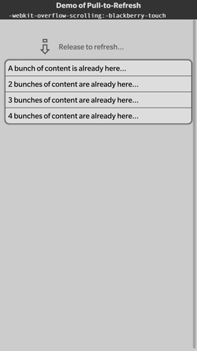

# Pull Down to Refresh Sample

This sample demostrates a standard way to implement pull down to refresh in browser/WebWorks applications on Blackberry 10. It is
implemented using proprietary webkit properties, therefore is not cross platform portable currently.

The sample code for this application is Open Source under the [Apache 2.0 License](http://www.apache.org/licenses/LICENSE-2.0.html).


**Applies To**

* [BlackBerry 10 WebWorks SDK 2.0](https://developer.blackberry.com/html5/download/sdk)

**Author(s)**

* [Eli Fiddler](http://www.twitter.com/chadtatro)
* [Adam Stanley](http://www.twitter.com/n_adam_stanley)

**Screenshot**



## How to Build

1. Clone this repo to your local machine.

2. Ensure the [BlackBerry 10 WebWorks SDK 2.0](https://developer.blackberry.com/html5/download/sdk) is correctly installed.

3. Open a command prompt (windows) or terminal (mac) and run the following command:

	```
	webworks create <your source folder>\PullDownToRefresh
	```

4. **Replace** the default PullDownToRefresh\www folder with the \www folder from **this** project

5. **Replace** the default PullDownToRefresh\config.xml with the config.xml from **this** project

6. From the command prompt (Windows) or terminal (mac), navigate to the PullDownToRefresh folder

	```
	cd <your source folder>\PullDownToRefresh
	```

7. Run the following command to build and deploy the app to a device connected via USB

	```
	webworks run
	```

## More Info

* [BlackBerry HTML5 WebWorks](https://bdsc.webapps.blackberry.com/html5/) - Downloads, Getting Started guides, samples, code signing keys.
* [BlackBerry WebWorks Development Guides](https://bdsc.webapps.blackberry.com/html5/documentation)
* [BlackBerry WebWorks Community Forums](http://supportforums.blackberry.com/t5/Web-and-WebWorks-Development/bd-p/browser_dev)


## Contributing Changes

Please see the [README](https://github.com/blackberry/BB10-WebWorks-Samples) of the BB10-WebWorks-Samples repository for instructions on how to add new Samples or make modifications to existing Samples.


## Bug Reporting and Feature Requests

If you find a bug in a Sample, or have an enhancement request, simply file an [Issue](https://github.com/blackberry/BB10-WebWorks-Samples/issues) for the Sample.

## Disclaimer

THE SOFTWARE IS PROVIDED "AS IS", WITHOUT WARRANTY OF ANY KIND, EXPRESS OR IMPLIED, INCLUDING BUT NOT LIMITED TO THE WARRANTIES OF MERCHANTABILITY, FITNESS FOR A PARTICULAR PURPOSE AND NONINFRINGEMENT. IN NO EVENT SHALL THE AUTHORS OR COPYRIGHT HOLDERS BE LIABLE FOR ANY CLAIM, DAMAGES OR OTHER LIABILITY, WHETHER IN AN ACTION OF CONTRACT, TORT OR OTHERWISE, ARISING FROM, OUT OF OR IN CONNECTION WITH THE SOFTWARE OR THE USE OR OTHER DEALINGS IN THE SOFTWARE.

