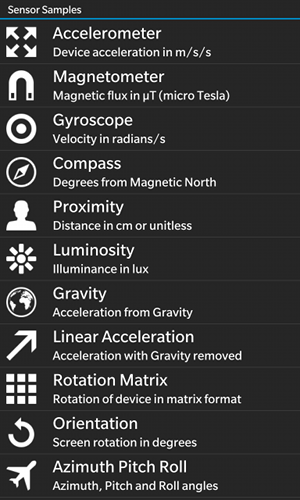
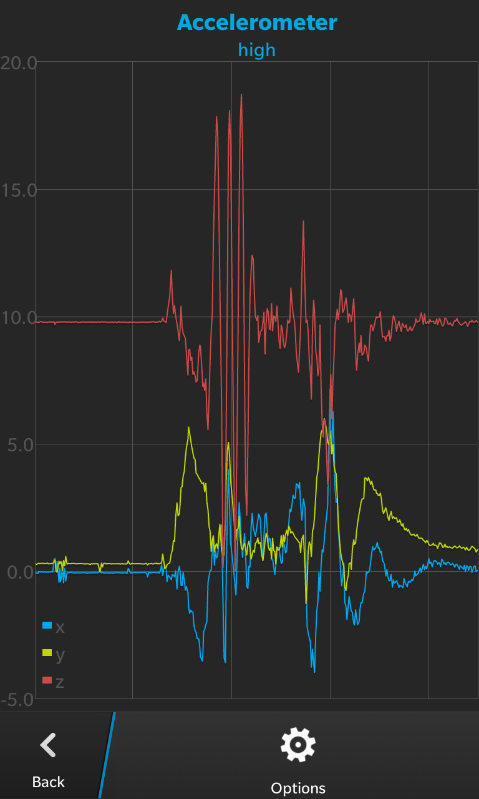
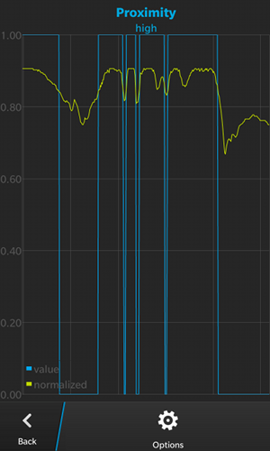
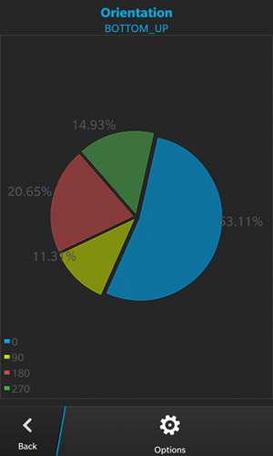
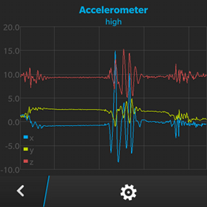

# Sensors Sample Application

This application shows how to use the various sensors on the device and capture the data points for display to the user, with the help of the Flotr2 graphing library.

The sample code for this application is Open Source under the [Apache 2.0 License](http://www.apache.org/licenses/LICENSE-2.0.html).

**Applies To**

* [BlackBerry WebWorks SDK for BB10](https://developer.blackberry.com/html5/) Version 2.0 or higher.


**Author(s)** 

* [Tim Windsor](https://github.com/timwindsor)

**Dependencies**

* [bbUI.js](https://github.com/blackberry/bbUI.js) version 0.9.6, available under the [Apache 2.0 License](http://www.apache.org/licenses/LICENSE-2.0.html).
* [Flotr2.js](https://github.com/HumbleSoftware/Flotr2), available under the [MIT License]()
* [Subway Icons by Pixle](http://subway.pixle.pl/rim/) Licensed under [CC-BY3](http://creativecommons.org/licenses/by/3.0/)

**Screenshots**

 &nbsp;
 &nbsp;
 &nbsp;
 &nbsp;


**Known Issues**

* The Y axis of the graphs is set to autoscale. When significant changes happen, there can be a pause while the graph recalculates the appropriate size, and no graph is shown temporarily.

* The Sensors API doesn't work in the Simulator.

**Tested On**
* BlackBerry 10 Dev Alpha B 10.0.9.1103
* BlackBerry Z10 10.1.0.1471, 10.2.1.1205
* BlackBerry Q10 10.1.0.1471


**To contribute code to this repository you must be [signed up as an official contributor](http://blackberry.github.com/howToContribute.html).**

## How to Build

1. Clone this repo to your local machine.

2. Ensure the [BlackBerry 10 WebWorks SDK 2.0](https://developer.blackberry.com/html5/download/sdk) is correctly installed.

3. Open a command prompt (windows) or terminal (mac) and run the following command:

	```
	webworks create <your source folder>\Sensors
	```

4. **Replace** the default CustomContext\www folder with the \www folder from **this** project

5. **Replace** the default CustomContext\config.xml with the config.xml from **this** project

6. From the command prompt (Windows) or terminal (mac), navigate to the Sensors folder

	```
	cd <your source folder>\Sensors
	```

7. Run the following commands to configure plugins used by **this app**

	```
	webworks plugin add com.blackberry.app
	webworks plugin add com.blackberry.sensors
	webworks plugin add com.blackberry.system
	```

8. Run the following command to build and deploy the app to a device connected via USB

	```
	webworks run
	```

## More Info

* [BlackBerry HTML5 WebWorks](https://bdsc.webapps.blackberry.com/html5/) - Downloads, Getting Started guides, samples, code signing keys.
* [BlackBerry WebWorks Development Guides](https://bdsc.webapps.blackberry.com/html5/documentation)
* [BlackBerry WebWorks Community Forums](http://supportforums.blackberry.com/t5/Web-and-WebWorks-Development/bd-p/browser_dev)
* [BlackBerry Open Source WebWorks Contributions Forums](http://supportforums.blackberry.com/t5/BlackBerry-WebWorks/bd-p/ww_con)

## Contributing Changes

Please see the [README](https://github.com/blackberry/BB10-WebWorks-Samples) of the WebWorks-Samples repository for instructions on how to add new Samples or make modifications to existing Samples.


## Bug Reporting and Feature Requests

If you find a bug in a Sample, or have an enhancement request, simply file an [Issue](https://github.com/blackberry/BB10-WebWorks-Samples/issues) for the Sample.


## Disclaimer

THE SOFTWARE IS PROVIDED "AS IS", WITHOUT WARRANTY OF ANY KIND, EXPRESS OR IMPLIED, INCLUDING BUT NOT LIMITED TO THE WARRANTIES OF MERCHANTABILITY, FITNESS FOR A PARTICULAR PURPOSE AND NONINFRINGEMENT. IN NO EVENT SHALL THE AUTHORS OR COPYRIGHT HOLDERS BE LIABLE FOR ANY CLAIM, DAMAGES OR OTHER LIABILITY, WHETHER IN AN ACTION OF CONTRACT, TORT OR OTHERWISE, ARISING FROM, OUT OF OR IN CONNECTION WITH THE SOFTWARE OR THE USE OR OTHER DEALINGS IN THE SOFTWARE.
