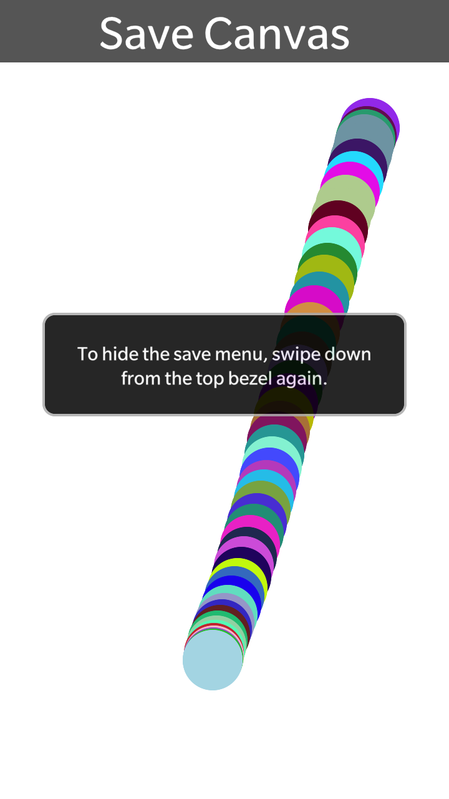
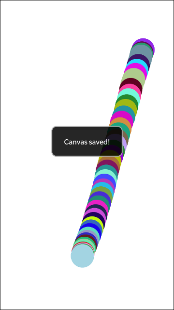
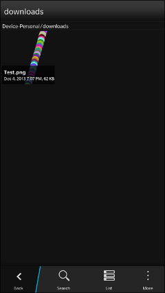

# Canvas To Filesystem Sample

This sample provides a basic canvas drawing implementation, along with functionality to save what has been drawn on the canvas as a PNG image to the BlackBerry 10 filesystem. All of the saving functionality is contained within saveCanvas.js.

For a full explanation of the code, please refer to this [Knowledge Base article](http://supportforums.blackberry.com/t5/Web-and-WebWorks-Development/How-To-Save-the-contents-of-a-lt-canvas-gt-element-to-the/ta-p/2103389).

**Applies To**

* [BlackBerry 10 WebWorks SDK 2.0+](https://developer.blackberry.com/html5/download/sdk) 

**Author(s)**

* [Erik Oros](http://www.twitter.com/WaterlooErik)

**Dependencies**

1. [canvas-toBlob.js](https://github.com/eligrey/canvas-toBlob.js) is [licensed](https://github.com/eligrey/canvas-toBlob.js/blob/master/LICENSE.md) under the MIT license.

**Contributing**

* To contribute code to this repository you must be [signed up as an official contributor](http://blackberry.github.com/howToContribute.html).

## Screenshots ##

 
 
 

## Requirements ##

####Cordova Plugins####

	com.blackberry.app
	com.blackberry.invoke
	com.blackberry.invoke.card
	com.blackberry.io
	com.blackberry.ui.toast

####BlackBerry Permissions####

	access_shared

## How to Build

1. Clone this repo to your local machine.
2. Ensure the [BlackBerry 10 WebWorks SDK 2.0](https://developer.blackberry.com/html5/download/sdk) is correctly installed.
3. Open a command prompt (windows) or terminal (mac) and run the following command:

	```
	webworks create <your source folder>\canvasToFilesystem
	```

3. **Replace** the default canvasToFilesystem\www folder with the \www folder from **this** project
4. From the command prompt (Windows) or terminal (mac), navigate to the canvasToFilesystem folder

	```
	cd <your source folder>\canvasToFilesystem
	```

5. Run the following commands to configure plugins used by **this app**

	```
	webworks plugin add com.blackberry.app
	webworks plugin add com.blackberry.invoke
	webworks plugin add com.blackberry.invoke.card
	webworks plugin add com.blackberry.io
	webworks plugin add com.blackberry.ui.toast
	```

6. Add the following to your config.xml

	```
	\<rim:permissions\>
		\<rim:permit\>access_shared\</rim:permit\>
	\</rim:permissions\>
	```
	
7. Run the following command to build and deploy the app to a device connected via USB

	```
	webworks run
	```