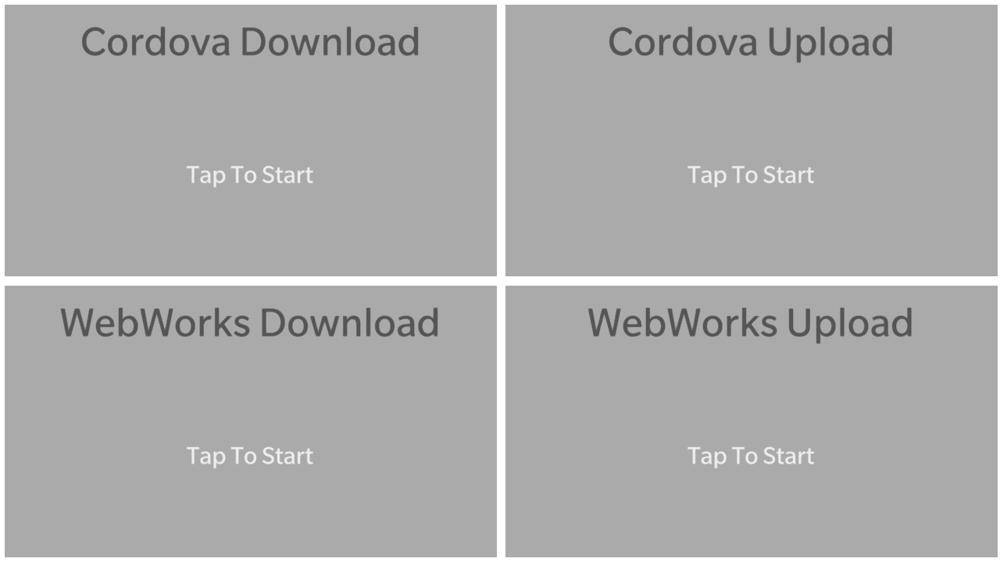
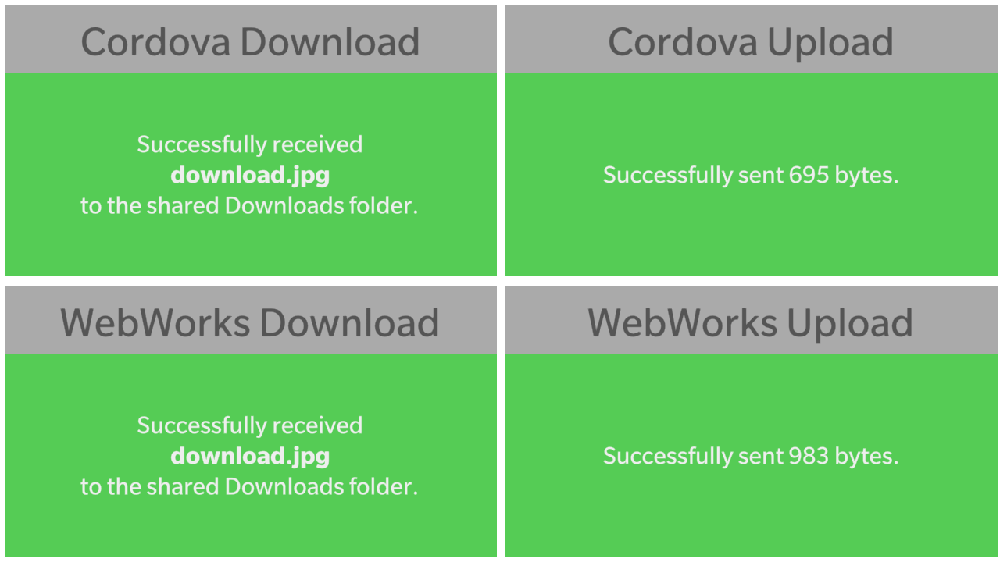

# FileTransfer API

This sample demonstrates how to leverage both WebWorks and Cordova FileTransfer APIs for upload and download. For more information please visit:
https://developer.blackberry.com/html5/apis/


The primary functionality is implemented in **index.html**..

**Applies To**

* [BlackBerry 10 WebWorks SDK 2.0+](https://developer.blackberry.com/html5/download/sdk) 

**Author(s)**

* [Erik Oros](http://www.twitter.com/WaterlooErik)

**Contributing**

* To contribute code to this repository you must be [signed up as an official contributor](http://blackberry.github.com/howToContribute.html).

## Screenshots ##

 
 

## Requirements ##

####Cordova Plugins####

	```
	com.blackberry.io
	com.blackberry.io.filetransfer
	com.blackberry.utils
	org.apache.cordova.file
	org.apache.cordova.file-transfer
	```

####BlackBerry Permissions####

You will need permission to access the shared file system in order to save downloaded files.

	```
	access_shared
	```

####Domain Whitelisting####

You will need to whitelist the domain of the external server that you will be downloading from / uploading to.

	```
	<access origin="http://domain.com" subdomains="true" />
	```

## How to Build

1. Clone this repo to your local machine.
2. Ensure the [BlackBerry 10 WebWorks SDK 2.0](https://developer.blackberry.com/html5/download/sdk) is correctly installed.
3. Open a command prompt (windows) or terminal (mac) and run the following command:

	```
	webworks create <your source folder>\fileTransfer
	```

3. **Replace** the default **fileTransfer\www** folder with the **\www** folder from **this** project
4. From the command prompt (Windows) or terminal (mac), navigate to the **fileTransfer** folder

	```
	cd <your source folder>\fileTransfer
	```

5. Run the following commands to configure plugins used by **this app**
	
	```
	webworks plugin add com.blackberry.io
	webworks plugin add com.blackberry.io.filetransfer
	webworks plugin add com.blackberry.utils
	webworks plugin add org.apache.cordova.file
	webworks plugin add org.apache.cordova.file-transfer
	```

6. Add the following to your config.xml

	```
	<rim:permissions>
		<rim:permit>access_shared</rim:permit>
	</rim:permissions>
	```
	
7. Run the following command to build and deploy the app to a device connected via USB

	```
	webworks run
	```
