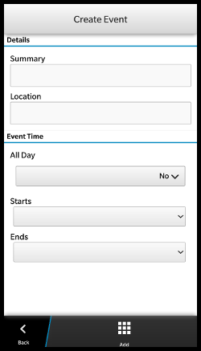
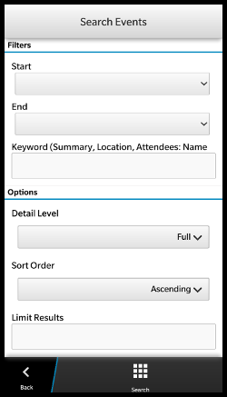
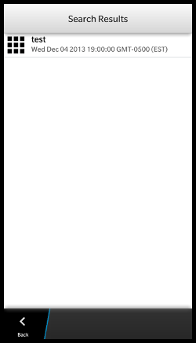

# PIM Calendar Sample

This sample demonstrates how to leverage the APIs for adding, searching for, and removing Calendar events. For more information on these APIs, please visit:
https://developer.blackberry.com/html5/apis/

This sample also makes use of BBUI.js, a UI framework designed for BlackBerry devices. For more information, please visit:
https://github.com/blackberry/bbUI.js

The primary functionality is implemented in **index.js**, while the remaining files are for laying out our UI components.

**Applies To**

* [BlackBerry 10 WebWorks SDK 2.0+](https://developer.blackberry.com/html5/download/sdk) 

**Author(s)**

* [Erik Oros](http://www.twitter.com/WaterlooErik)

**Contributing**

* To contribute code to this repository you must be [signed up as an official contributor](http://blackberry.github.com/howToContribute.html).

## Screenshots ##

 
 
 
 

## Requirements ##

####Cordova Plugins####

	com.blackberry.app
	com.blackberry.pim.calendar
	com.blackberry.system
	com.blackberry.ui.contextmenu

####BlackBerry Permissions####

	access_pimdomain_calendars

## How to Build

1. Clone this repo to your local machine.

2. Ensure the [BlackBerry 10 WebWorks SDK 2.0](https://developer.blackberry.com/html5/download/sdk) is correctly installed.

3. Open a command prompt (windows) or terminal (mac) and run the following command:

	```
	webworks create <your source folder>\pimcalendar
	```

4. **Replace** the default pimcalendar\www folder with the \www folder from **this** project

5. **Replace** the default pimcalendar\config.xml with the config.xml from **this** project

6. From the command prompt (Windows) or terminal (mac), navigate to the pimcalendar folder

	```
	cd <your source folder>\pimcalendar
	```

7. Run the following commands to configure plugins used by **this app**
	
	```
	webworks plugin add com.blackberry.app
	webworks plugin add com.blackberry.pim.calendar
	webworks plugin add com.blackberry.system
	webworks plugin add com.blackberry.ui.contextmenu
	```

8. Add the following to your config.xml

	```
	<rim:permissions>
		<rim:permit>access_pimdomain_calendars</rim:permit>
	</rim:permissions>
	```
	
9. Run the following command to build and deploy the app to a device connected via USB

	```
	webworks run
	```
	
	## More Info

* [BlackBerry HTML5 WebWorks](https://bdsc.webapps.blackberry.com/html5/) - Downloads, Getting Started guides, samples, code signing keys.
* [BlackBerry WebWorks Development Guides](https://bdsc.webapps.blackberry.com/html5/documentation)
* [BlackBerry WebWorks Community Forums](http://supportforums.blackberry.com/t5/Web-and-WebWorks-Development/bd-p/browser_dev)
* [BlackBerry Open Source WebWorks Contributions Forums](http://supportforums.blackberry.com/t5/BlackBerry-WebWorks/bd-p/ww_con)

## Contributing Changes

Please see the [README](https://github.com/blackberry/BB10-WebWorks-Samples) of the BB10-WebWorks-Samples repository for instructions on how to add new Samples or make modifications to existing Samples.

## Bug Reporting and Feature Requests

If you find a bug in a Sample, or have an enhancement request, simply file an [Issue](https://github.com/blackberry/BB10-WebWorks-Samples/issues) for the Sample.

## Disclaimer

THE SOFTWARE IS PROVIDED "AS IS", WITHOUT WARRANTY OF ANY KIND, EXPRESS OR IMPLIED, INCLUDING BUT NOT LIMITED TO THE WARRANTIES OF MERCHANTABILITY, FITNESS FOR A PARTICULAR PURPOSE AND NONINFRINGEMENT. IN NO EVENT SHALL THE AUTHORS OR COPYRIGHT HOLDERS BE LIABLE FOR ANY CLAIM, DAMAGES OR OTHER LIABILITY, WHETHER IN AN ACTION OF CONTRACT, TORT OR OTHERWISE, ARISING FROM, OUT OF OR IN CONNECTION WITH THE SOFTWARE OR THE USE OR OTHER DEALINGS IN THE SOFTWARE.

