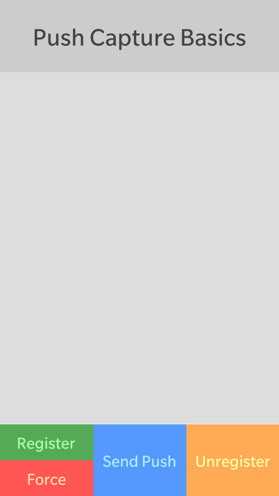
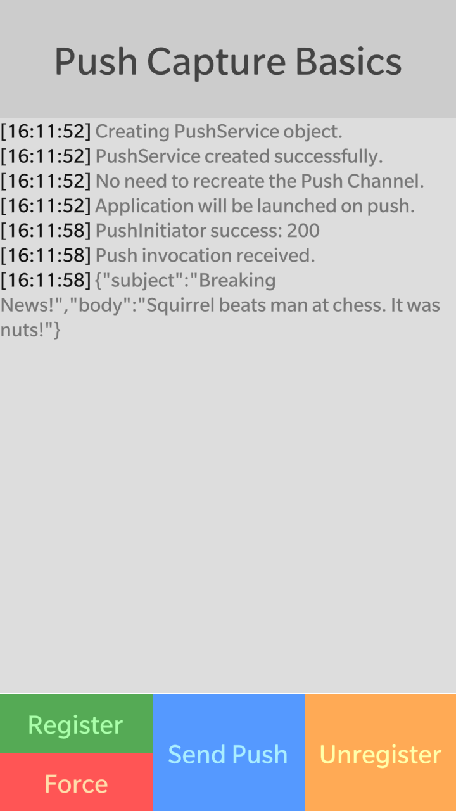

# Push Capture Basics

This sample demonstrates how to implement BlackBerry Push into your application:
https://developer.blackberry.com/html5/apis/


The primary client functionality is implemented in **pushClient.js**..

**Applies To**

* [BlackBerry 10 WebWorks SDK 2.0+](https://developer.blackberry.com/html5/download/sdk) 

**Author(s)**

* [Erik Oros](http://www.twitter.com/WaterlooErik)

**Contributing**

* To contribute code to this repository you must be [signed up as an official contributor](http://blackberry.github.com/howToContribute.html).

## Screenshots ##

&nbsp;
 

## Requirements ##

####Cordova Plugins####

**com.blackberry.utils** will be added automatically. You will need to manually add these plugins:

	com.blackberry.identity
	com.blackberry.invoked
	com.blackberry.push

####Domain Whitelisting####

You will need to whitelist the BlackBerry Push servers for initiating pushes.

	<access origin="https://pushapi.eval.blackberry.com" subdomains="true" />

## How to Build

1. Clone this repo to your local machine.
2. Ensure the [BlackBerry 10 WebWorks SDK 2.0](https://developer.blackberry.com/html5/download/sdk) is correctly installed.
3. Open a command prompt (windows) or terminal (mac) and run the following command:

	```
	webworks create <your source folder>\pushCaptureBasics
	```

3. **Replace** the default **pushCaptureBasics\www** folder with the **\www** folder from **this** project
4. From the command prompt (Windows) or terminal (mac), navigate to the **pushCaptureBasics** folder

	```
	cd <your source folder>\pushCaptureBasics
	```

5. Run the following commands to configure plugins used by **this app**
	
	```
	webworks plugin add com.blackberry.identity
	webworks plugin add com.blackberry.invoked
	webworks plugin add com.blackberry.push
	```

6. Update the following files.

	```
	config.xml: You will need to modify the application ID and invoke-target ID to something unique; replace the @ symbols.

		id="com.@@@@@@@@.pushcapturebasics"
		
		id="com.@@@@@@@@.pushcapturebasics.invoke.push"
	
	pushClient.js: Update the ops variable with your own client push credentials; replace the @ symbols.
	
		'ops': {
			'invokeTargetId': 'com.@@@@@@@@.pushcapturebasics.invoke.push',
			'appId': '@@@@-@@@@@@@@@@@@@@@@@@@@@@@@@@@@@@@@@@@',
			'ppgUrl': 'http://cp@@@@.pushapi.eval.blackberry.com'
		},
	
	pushInitiator.js: Update the config variable with your own server push credentials; replace the @ symbols.
	
		pushInitiator.config = {
			'ppgUrl' : 'https://cp@@@@.pushapi.eval.blackberry.com',
			'appId' : '@@@@-@@@@@@@@@@@@@@@@@@@@@@@@@@@@@@@@@@@',
			'pwd' : '@@@@@@@@',
			'recipient' : blackberry.identity.uuid.substring(2),
			'data' : JSON.stringify({
				'subject' : 'Breaking News!',
				'body' : 'Squirrel beats man at chess. It was nuts!'
			})
		};
	```

7. Run the following command to build and deploy the app to a device connected via USB

	```
	webworks run
	```
